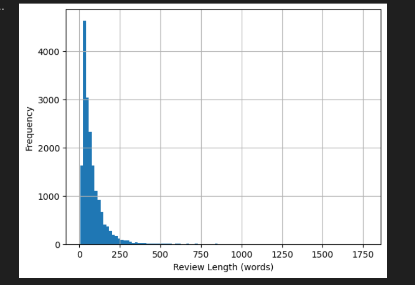
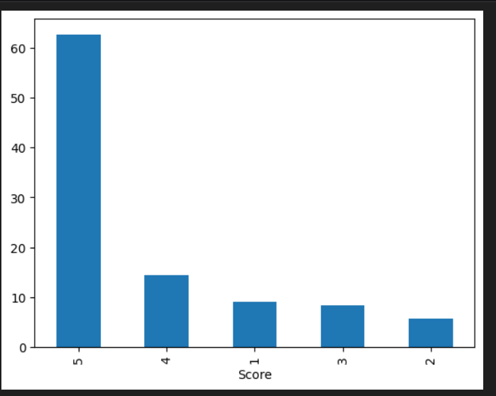
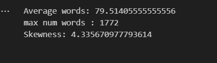
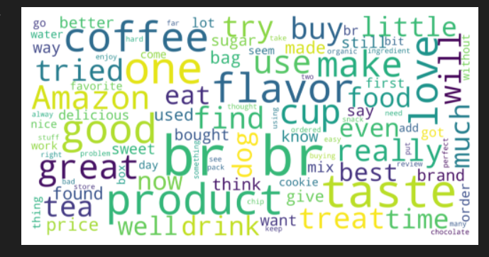
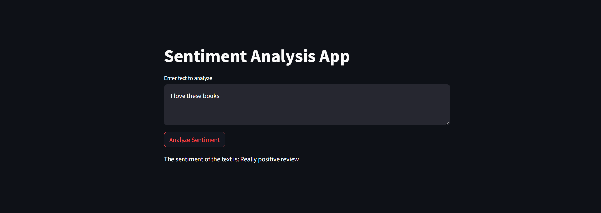

# Fine-tune DistilBERT-base-uncased for Sentiment Analysis

## Dataset

The dataset used for this project is the Amazon Fine Food Reviews dataset, available [here](https://www.kaggle.com/datasets/snap/amazon-fine-food-reviews). Please download the dataset from the provided link.

## Problem Statement

The objective of this project is to perform sentiment analysis on Amazon Fine Food reviews using the DistilBERT model. Sentiment analysis aims to determine the sentiment expressed in a piece of text, which can be positive, negative, or neutral.

Columns:
1. Id: The unique identifier for each review entry.
1. ProductId: The unique identifier for the product being reviewed.
1. UserId: The unique identifier for the user who wrote the review.
1. ProfileName: The name or profile of the user who wrote the review.
1. HelpfulnessNumerator: The number of users who found the review helpful.
1. HelpfulnessDenominator: The total number of users who voted on whether the review was helpful or not.
1. Score: The rating given by the user for the product, ranging from 1 to 5.
1. Time: The timestamp indicating when the review was posted, in Unix time format (seconds since January 1, 1970).
1. Summary: A brief summary or headline for the review.
1. Text: The main body of the review, containing the detailed feedback or description provided by the user about the product.

## Key Steps

- **Preprocessing:** Clean and preprocess the text data, including tasks such as removing stopwords, punctuation, and handling special characters.
- **EDA (Exploratory Data Analysis):** Explore the dataset to gain insights into the distribution of sentiment labels, the length of reviews, and any patterns present in the data.
- **NLP Tasks:** Perform Natural Language Processing (NLP) tasks such as tokenization, encoding, and preparing the data for training the model.
- **Training:** Fine-tune the DistilBERT-base-uncased model on the preprocessed data for sentiment analysis.
- **Model Evaluation:** Evaluate the performance of the trained model using appropriate evaluation metrics such as accuracy, precision, recall, and F1-score.


## EDA (Exploratory Data Analysis)

Description:
This bar chart visualizes the distribution of review lengths in terms of word count. The x-axis represents different bins or ranges of word counts, while the y-axis shows the frequency or number of reviews falling into each bin. The purpose of this chart is to give an overview of how lengthy the reviews typically are, which can help in understanding the nature of the text data and deciding on any preprocessing steps.

Insights:

The chart may reveal whether reviews tend to be short, medium-length, or long.
Peaks in the distribution can indicate common review lengths.
Skewness can suggest if the majority of reviews are short or long.



Description:
This histogram or bar chart shows the distribution of rating scores given by users. The x-axis represents the possible rating scores (e.g., 1 to 5 stars), and the y-axis represents the number of reviews that fall into each rating category. This visualization helps in understanding the overall sentiment distribution and identifying any biases in the ratings.

Insights:

If most reviews have high ratings, it suggests general satisfaction.
A balanced distribution indicates varied user opinions.
Skewness toward lower ratings may signal widespread dissatisfaction.



Description:
This summary table  provides key statistical metrics of the dataset, such as:

Average Words per Review: The mean number of words across all reviews.
Maximum Number of Words: The longest review in terms of word count.
Skewness: A measure of the asymmetry of the review length distribution.

Insights:
The average words per review give an idea of typical review length.
The maximum number of words indicates the longest review.
Skewness helps understand if the distribution of review lengths is balanced or if it leans towards shorter or longer reviews.


Description:
This word cloud visualizes the most frequently occurring words in the review texts. Larger words indicate higher frequency, while smaller words indicate lower frequency. This visualization is useful for quickly identifying common themes and topics mentioned by users.

Insights:

Commonly used words can highlight important aspects or frequent issues.
Positive or negative words can suggest the overall sentiment of the reviews.
Repeated phrases or product features can provide insights into what users focus on most.
These visualizations collectively help in understanding the dataset's structure, the distribution of key variables, and the main themes in the review texts, aiding in further analysis and decision-making.

## Training

For the training phase, we fine-tuned the DistilBERT-base-uncased model using the Amazon Fine Food Reviews dataset.

Model Description
DistilBERT is a transformers model designed to be smaller and faster than BERT, while retaining similar performance. It was pretrained using the BERT base model as a teacher on the same corpus in a self-supervised manner, meaning it was trained solely on raw text data without any human labeling. DistilBERT's pretraining involved three key objectives:

Distillation Loss: The model was trained to produce the same probability distributions as the BERT base model.
Masked Language Modeling (MLM): Similar to BERT, the model randomly masks 15% of the words in the input sentence. It then predicts the masked words, allowing it to learn a bidirectional representation of the sentence, unlike traditional RNNs or autoregressive models like GPT.
Cosine Embedding Loss: The model was also trained to generate hidden states that closely match those of the BERT base model.
By achieving these objectives, DistilBERT learns the same internal representations of the English language as BERT but is more efficient, making it faster for inference and downstream tasks.

The training process involved the following steps:

Preprocessing:

1. Tokenized the text data using DistilBERT's tokenizer.
1. Converted the tokens to input IDs and attention masks.
1. Split the data into training and validation sets.

Model Training:

1. Initialized the DistilBERT-base-uncased model with a classification head.
1. Trained the model for 2 epochs using the training set.
1. Used a learning rate of 2e-5 and the AdamW optimizer.
1. Implemented early stopping based on the validation loss to prevent overfitting.


## Model Evaluation

```

```

```
Confusion Matrix:
[[ 230   21   21    8   29]
 [  65   47   56   26   20]
 [  31   28   59  140   55]
 [  15    5    9  174  340]
 [  13    0    6   75 2127]]
Accuracy: 0.7410
Precision: 0.7325
Recall: 0.7325
F1-score: 0.7325
```

## Output

Input: Maybe not worth it to buy
Result: The sentiment of the text is: Neutral review



##
API
POST: {host}/predict

```json
{
    "text": "Maybe not worth it"
}
```

## How to Deploy

### Requirements

- Docker
- Pytorch

### Deployment Steps

1. Build the Docker image:
```
docker-compose build
```

2. Run the Docker image:
```
docker-compose up
```

Api will be run in localhost:5000
Application will be run in localhost:8501